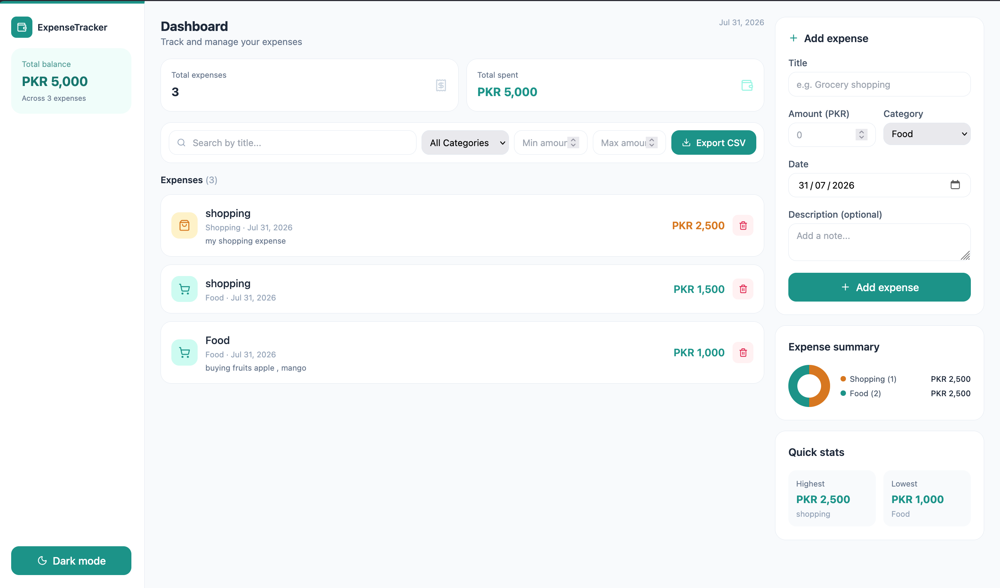

# ExpenseTracker — Frontend

A React (Vite) + Tailwind CSS dashboard for managing personal expenses. Talks to the deployed Express REST API for all expense operations including CRUD, filtering, statistics, and CSV export.
Built as part of the TechnerLab Bootcamp (MERN Stack + AI Engineering) — Assignment 1.

---

## 🌐 Live Demo

**Frontend**
https://expense-tracker-frontend-nu-six.vercel.app

**Backend API**
https://expensetracker-backend-7io2.onrender.com

---

---

## Screenshot

### Dashboard



---

## Table of Contents

- [Overview](#overview)
- [Tech Stack](#tech-stack)
- [Project Structure](#project-structure)
- [Setup & Installation](#setup--installation)
- [Configuration](#configuration)
- [Features](#features)
- [Component Reference](#component-reference)
- [Styling & Theming](#styling--theming)
- [Responsive Design](#responsive-design)
- [Bonus Features](#bonus-features)
- [Troubleshooting](#troubleshooting)

---

## Overview

The frontend is a single-page dashboard: a sidebar with account/balance
info, a main column showing stat cards, filters, and the expense list, and
a right column with the add-expense form and a category summary.

All state (expenses, stats, filters, dark mode) lives in `App.jsx` and
flows down to components as props — there's no external state management
library, since the app's data needs are simple enough for plain `useState`
+ `useEffect`.

---

## Tech Stack

| Tool | Purpose |
|---|---|
| React (Vite) | UI framework + fast dev server |
| Tailwind CSS v3 | Utility-first styling, including dark mode |
| Lucide React | Category and UI icons |

No external state management, routing, or chart libraries are used — the
donut chart in the stats panel is built with a plain CSS `conic-gradient`.

---

## Project Structure

```text
expensetracker-frontend/
├── index.html
├── tailwind.config.js # darkMode: 'class'
├── postcss.config.js
├── package.json
└── src/
├── main.jsx
├── App.jsx # All state + data fetching lives here
├── index.css # Tailwind directives only
├── api/
│ └── expenseApi.js # Every fetch() call lives here — nowhere else
├── utils/
│ └── categoryConfig.js # Single source of truth: icon/color per category
└── components/
├── Sidebar.jsx # Logo, total balance, dark mode toggle
├── ExpenseForm.jsx # Add-expense form
├── FilterBar.jsx # Search, category, min/max, CSV export
├── ExpenseList.jsx # Maps expenses → ExpenseItem, or empty state
├── ExpenseItem.jsx # One expense card — inline edit + delete
└── StatsPanel.jsx # Donut chart + highest/lowest quick stats
```

---

## Setup & Installation

```bash
npm install
```

Create a `.env` file:

```env
VITE_API_URL=http://localhost:3000/api/expenses
```

Run the development server:

```bash
npm run dev
```

Runs on:

```
http://localhost:5173
```

---

## Configuration

The frontend uses a Vite environment variable for the backend API URL.

Create a `.env` file in the project root:

```env
VITE_API_URL=http://localhost:3000/api/expenses
```

For production (Vercel), set:

```env
VITE_API_URL=https://expensetracker-backend-7io2.onrender.com/api/expenses
```

The application reads the API URL using:

```javascript
const BASE_URL = import.meta.env.VITE_API_URL;
```

---

## Features

- **Live dashboard** — stat cards for total expense count and total amount spent
- **Add expenses** — controlled form with client-side validation (title + amount required)
- **Inline editing** — click any expense's title or amount to edit it directly, no modal or separate form
- **Delete with confirmation** — a native `confirm()` dialog guards against accidental deletes
- **Real-time filtering** — search by title, filter by category, and set a min/max amount range; all combinable, and the expense list re-fetches automatically whenever any filter changes
- **Category summary** — a CSS conic-gradient donut chart plus a per-category legend, built entirely from the live `/stats` response
- **Highest/lowest expense** — quick-glance stat cards pulled straight from the backend
- **CSV export** — one click opens `/api/expenses/export` in a new tab, triggering a file download
- **Dark mode** — toggled via a button in the sidebar; persists only for the current session (not saved to storage)
- **Fully responsive** — sidebar and columns stack vertically on mobile, and sit side-by-side from the `lg` breakpoint up

---

## Component Reference

| Component | Props | Responsibility |
|---|---|---|
| `App.jsx` | — | Owns `expenses`, `stats`, `filters`, `darkMode` state; fetches data; passes handlers down |
| `Sidebar.jsx` | `totalAmount`, `totalExpenses`, `darkMode`, `onToggleDarkMode` | Logo, total balance summary card, dark mode toggle button |
| `ExpenseForm.jsx` | `onCreate` | Controlled form; validates title/amount before calling `onCreate` |
| `FilterBar.jsx` | `filters`, `onFilterChange` | Search input, category dropdown, min/max inputs, CSV export button |
| `ExpenseList.jsx` | `expenses`, `onDelete`, `onUpdated` | Renders `ExpenseItem`s or an empty state message |
| `ExpenseItem.jsx` | `expense`, `onDelete`, `onUpdated` | Displays one expense; handles its own inline-edit state locally |
| `StatsPanel.jsx` | `stats` | Donut chart + category legend + highest/lowest cards |

### Data Flow

```text
App.jsx
├── fetches expenses + stats on mount and whenever filters change
├── passes filters + handleFilterChange → FilterBar
├── passes expenses + handleDelete + fetchExpenses(as onUpdated) → ExpenseList
│ └── ExpenseList → ExpenseItem (per expense)
├── passes handleCreate → ExpenseForm
└── passes stats → StatsPanel
```

Every mutation (create, update, delete) triggers a **re-fetch** of both
`expenses` and `stats` from the backend — the UI never mutates local state
optimistically, so what's on screen always reflects what the backend
actually has.

---

## Styling & Theming

- **Font:** Inter (via Tailwind's default sans stack)
- **Primary accent:** Teal (`teal-600` / `teal-400` in dark mode)
- **Category colors:** each category in `categoryConfig.js` has its own
  Tailwind classes (icon background/color) *and* a raw hex value (`dot`) —
  the hex value exists because the donut chart's `conic-gradient` is plain
  CSS and can't consume Tailwind's color classes directly
- **Border radius:** `rounded-xl` / `rounded-2xl` throughout for a soft, modern feel
- **Dark mode:** enabled via `darkMode: 'class'` in `tailwind.config.js`;
  toggling adds/removes a `dark` class on `<html>` in `App.jsx`, and every
  component includes matching `dark:` variants

To add a new expense category, only `utils/categoryConfig.js` needs to
change — every component reads from it rather than hardcoding category
lists or colors.

---

## Responsive Design

| Breakpoint | Layout |
|---|---|
| Below `lg` (mobile/tablet) | Sidebar becomes a horizontal bar at the top; main content and the form/stats column stack vertically |
| `lg` and up (desktop) | Sidebar is a fixed-width left column; main content and the form/stats column sit side-by-side |

Key Tailwind patterns used: `flex-col lg:flex-row`, `w-full lg:w-56`,
`grid-cols-2` (kept constant for stat cards at all sizes, since two cards
fit comfortably even on small screens).

---

## Bonus Features

| Feature | Where it lives |
|---|---|
| Inline editing | `ExpenseItem.jsx` — local `isEditing` state swaps display text for inputs |
| Dark mode toggle | `App.jsx` (state + `useEffect`) + `Sidebar.jsx` (button) |
| CSV export | `FilterBar.jsx` calls `exportExpensesCSV()` from `api/expenseApi.js`, which opens the backend's `/export` endpoint in a new tab |

---

## Troubleshooting

**"Failed to load expenses. Is the backend running?"**
If running locally, ensure the backend server is started.
If using the deployed application, verify that the Render backend is awake and accessible.

**Dark mode toggle doesn't change any colors**
Confirm `darkMode: 'class'` is set in `tailwind.config.js`, then restart
the Vite dev server — Tailwind config changes require a restart to take
effect, a hot-reload isn't enough.

**Category badge/icon shows as "Other" for a valid category**
`categoryConfig.js` only defines styling for the 6 known categories —
double-check the category string being saved matches one of those keys
exactly (case-sensitive).